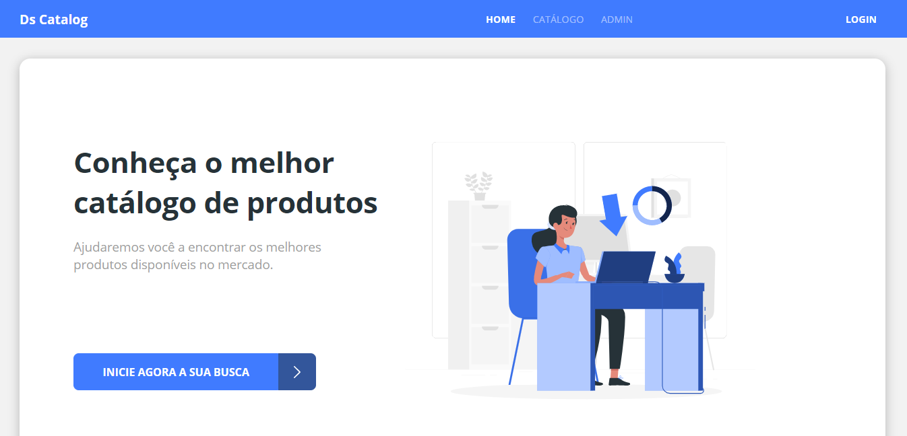
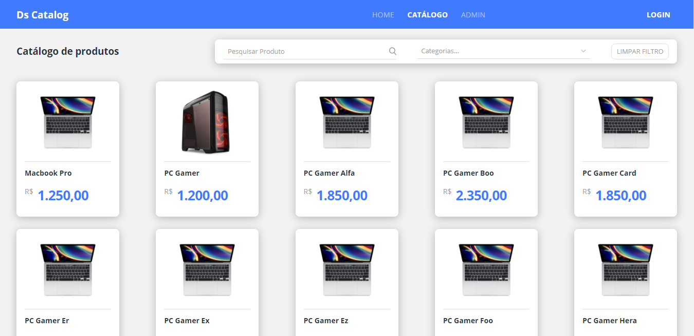
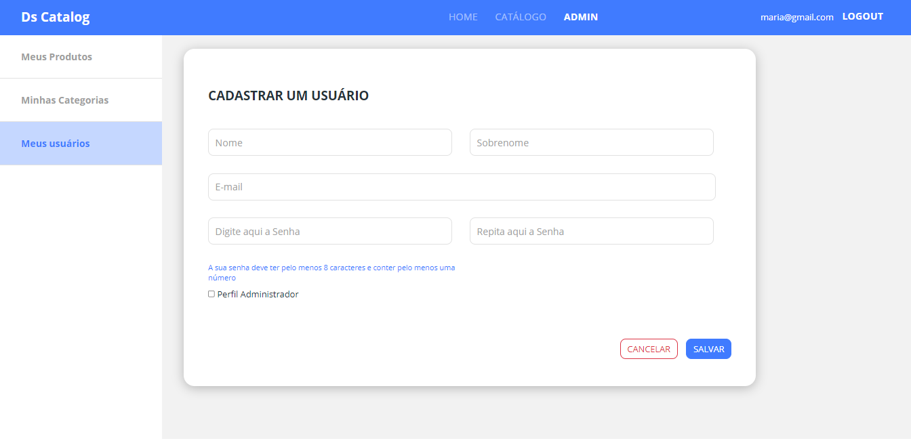
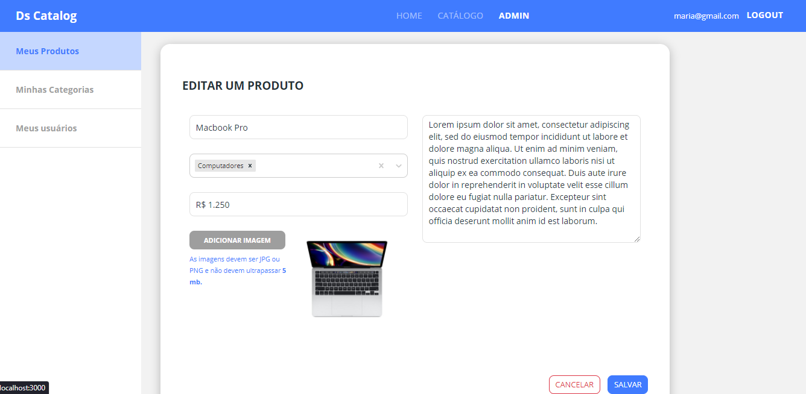
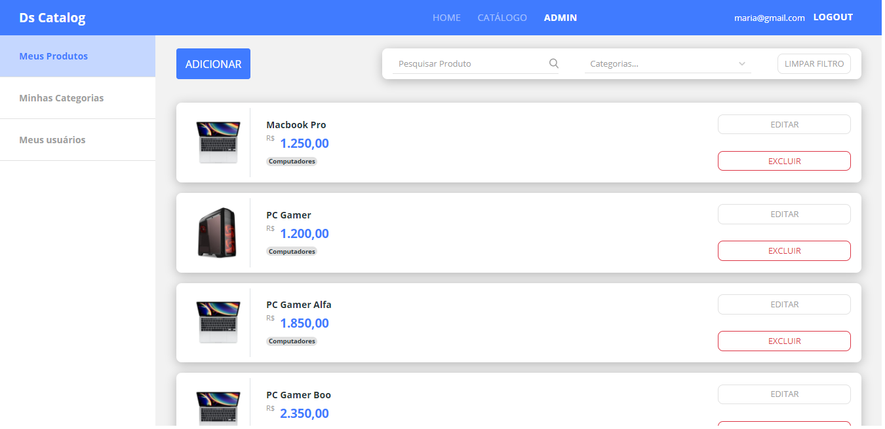

O dscatalog-bootcamp é uma aplicação full-stack desenvolvida no bootcamp da DevSuperior, focada em um catálogo de produtos, categorias e usuários, com funcionalidades de CRUD, segurança e testes.

Algumas imagens do projeto:

  
  
  
  
  
  
  
  
  

DSCatalog - Catálogo de Produtos e Usuários
📝 Descrição do Projeto
O DSCatalog é uma aplicação web full-stack, desenvolvida durante o Bootcamp Java Spring da DevSuperior (Professor Nelio Alves). Este projeto consiste em um sistema completo de catálogo, onde é possível gerenciar produtos, categorias e usuários, com diferentes níveis de acesso e funcionalidades de autenticação e autorização.

Este repositório foca primariamente na implementação do backend da aplicação, que expõe uma API RESTful para as operações de gerenciamento de dados.

✨ Funcionalidades
CRUD Completo: Operações de Criação, Leitura, Atualização e Deleção (CRUD) para:

Produtos

Categorias

Usuários

Autenticação e Autorização: Sistema de login baseado em OAuth2 e JWT (JSON Web Tokens), com gerenciamento de perfis de usuário (administrador, operador).

Validação de Dados: Utilização de Jakarta Bean Validation para garantir a integridade dos dados.

Padrões REST: Implementação de uma API RESTful seguindo as melhores práticas.

Paginação e Filtros: Funcionalidades de paginação para listagens de produtos e categorias.

Modelo concetual:

  

🚀 Tecnologias Utilizadas
Este projeto foi construído utilizando as seguintes tecnologias e ferramentas:

Backend
Linguagem: Java

Framework: Spring Boot

Spring Data JPA (para persistência de dados)

Spring Security (para segurança e autenticação/autorização)

Spring Web (para a criação de APIs REST)

Banco de Dados: PostgreSQL (com H2 para testes em memória)

Ferramenta de Build: Maven

Testes:

JUnit 5

Mockito

MockMvc

TDD (Test Driven Development)

Outras:

Jakarta Bean Validation

JWT (JSON Web Tokens)

OAuth2

Frontend 
Linguagem: TypeScript

Framework/Biblioteca: React

Roteamento: React Router DOM

Requisições HTTP: Axios

Estilização: CSS / SCSS (Bootstrap ou outra biblioteca de UI, se usada)

⚙️ Como Rodar o Projeto (Backend)
Siga os passos abaixo para configurar e rodar o backend localmente:

Pré-requisitos
Certifique-se de ter as seguintes ferramentas instaladas:

Java Development Kit (JDK) 17 ou superior

Maven

PostgreSQL (ou Docker para PostgreSQL)

Uma IDE como Spring Tool Suite (STS) ou IntelliJ IDEA

Configuração do Banco de Dados
Crie um banco de dados PostgreSQL com o nome dscatalog (ou o nome que preferir).

Configure as credenciais do banco de dados no arquivo src/main/resources/application.properties ou application.yml:

Properties

spring.datasource.url=jdbc:postgresql://localhost:5432/dscatalog
spring.datasource.username=YOUR_USERNAME
spring.datasource.password=YOUR_PASSWORD
(Substitua YOUR_USERNAME e YOUR_PASSWORD pelas suas credenciais do PostgreSQL).

Rodando a Aplicação
Clone o repositório:

Bash

git clone https://github.com/TiagoBaratieri/dscatalog-bootcamp.git
cd dscatalog-bootcamp
Navegue até a pasta do backend:

Bash

# Se o backend estiver em uma subpasta (ex: 'backend/')
# cd backend/
Construa o projeto com Maven:

Bash

mvn clean install
Execute a aplicação:

Bash

mvn spring-boot:run
A API estará disponível em http://localhost:8080.

🧪 Rodando os Testes
Para executar os testes automatizados do projeto:

Bash

mvn test
🤝 Contribuição
Contribuições são bem-vindas! Se você tiver sugestões, melhorias ou encontrar bugs, sinta-se à vontade para:

Abrir uma Issue.

Fazer um Fork.

Criar um Pull Request.

🎓 Aprendizado e Reconhecimento
Este projeto foi fundamental para solidificar conhecimentos em:

Desenvolvimento de APIs RESTful com Spring Boot.

Modelagem de dados com JPA e Hibernate.

Implementação de segurança com Spring Security e OAuth2.

Escrita de testes unitários e de integração (TDD).

Padrões de projeto e boas práticas de desenvolvimento.

Agradecimento especial à DevSuperior e ao Professor Nelio Alves pelo excelente conteúdo e orientação.

